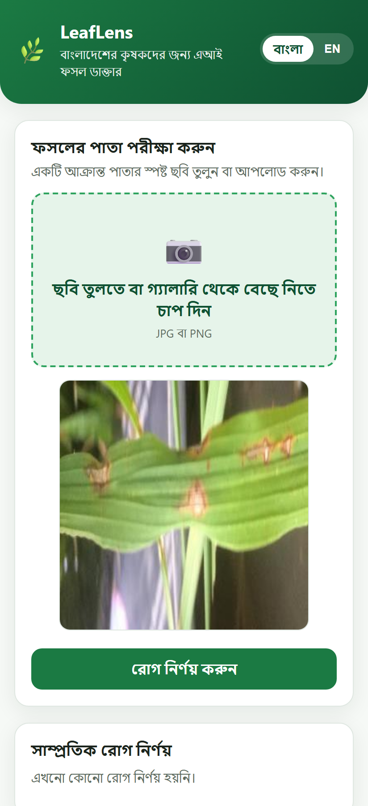
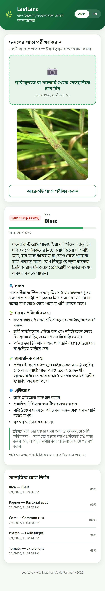
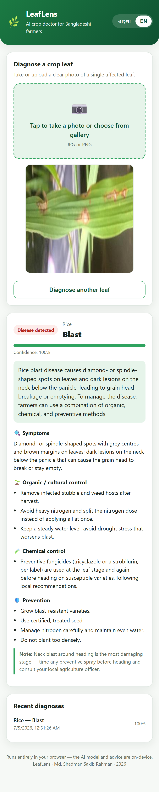
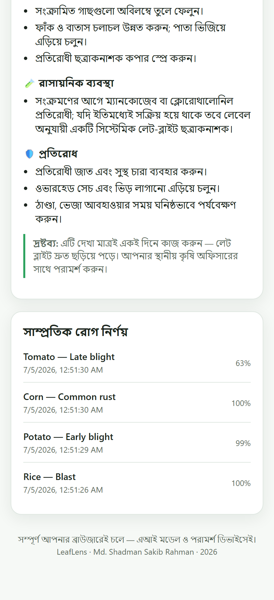

# LeafLens 🌿

**Point your phone at a sick crop leaf and get an instant diagnosis plus a treatment plan in plain Bangla.**

LeafLens is my AI capstone project. It is a crop-disease doctor built for Bangladeshi
farmers: you take a photo of an affected leaf, a vision model tells you which crop and
disease it is, and a grounded advisor gives you what to do about it — organic steps,
chemical options, and prevention — in Bangla or English.

## Live demo

- **App (try it):** https://4emonrahman2-leaflens.hf.space
- **Backend API + docs:** https://4emonrahman2-leaflens-api.hf.space/docs

> Heads up: the backend runs on a free Hugging Face Space that goes to sleep when idle.
> The first request after a while can take up to a minute to wake up — the app shows a
> "waking up" message while that happens.

## Screenshots

| Upload (Bangla) | Diagnosis + advice (Bangla) | Diagnosis + advice (English) | History |
|---|---|---|---|
|  |  |  |  |

## What problem this solves

About 40% of Bangladesh's workforce is in agriculture, and a lot of avoidable crop loss
comes from disease that is spotted late or treated with the wrong chemical. Most farmers
can't quickly reach an agriculture officer, so they guess — and guessing wrong wastes
money and hurts the soil. LeafLens gives an instant, grounded second opinion in the
farmer's own language.

## How it works

There are two AI parts working together:

1. **Vision model — the diagnosis.** A MobileNetV2 convolutional network, pretrained on
   ImageNet and fine-tuned on real leaf-disease photos. It covers **5 crops** (rice, potato,
   tomato, maize, pepper) across **20 classes**, and reaches **95.9%
   accuracy** on a held-out test set. It also returns a confidence score — and if it isn't
   confident, the app refuses to guess and tells you to retake the photo or ask an expert.

2. **Advisor — the treatment plan.** The treatment facts live in a curated knowledge base
   (not made up by an AI). When a disease is found, the backend looks up its entry and a
   Groq LLM (llama-3.3-70b) rewrites those exact facts into simple Bangla with a short
   summary. The model is told to use only those facts, so it can't invent treatments. If
   the LLM is unavailable, the app just shows the verified English facts.

```
React app (Vercel)  ──HTTPS──▶  FastAPI (Hugging Face Spaces)
 camera + advice                 MobileNetV2  +  knowledge base  +  Groq
                                 SQLite history
```

## Tech stack

- **Frontend:** Next.js (React), deployed on Vercel
- **Backend:** FastAPI (Python) in Docker, deployed on Hugging Face Spaces
- **AI/ML:** PyTorch + torchvision (MobileNetV2), scikit-learn for metrics, Groq API
- **Database:** SQLite
- **Data:** Hugging Face `datasets` (PlantVillage + a rice-leaf dataset)

## Project structure

```
leaflens/
├── frontend/          Next.js app (the UI)
├── backend/           FastAPI service
│   ├── app/           main.py, model.py, advisor.py, db.py, knowledge_base.json
│   ├── model/         weights.pt, labels.json, metrics.json, confusion_matrix.png
│   └── Dockerfile     container for Hugging Face Spaces
├── ml/                data prep + training
│   ├── prepare_data.py
│   ├── train.py
│   └── train_colab.ipynb
└── docs/              proposal + final report
```

## Run it yourself

### Backend

```bash
cd backend
py -3.12 -m venv venv
venv\Scripts\python.exe -m pip install -r requirements.txt
copy .env.example .env         # then paste your GROQ_API_KEY
venv\Scripts\python.exe -m uvicorn app.main:app --reload
# API on http://localhost:8000  (docs at /docs)
```

You need a trained model in `backend/model/` (`weights.pt` + `labels.json`). It's
committed in this repo; to retrain, see below.

### Frontend

```bash
cd frontend
npm install
copy .env.example .env.local   # set NEXT_PUBLIC_API_BASE=http://localhost:8000
npm run dev
# App on http://localhost:3000
```

### Retrain the model

```bash
py -3.12 -m venv venv
venv\Scripts\python.exe -m pip install -r ml/requirements.txt
venv\Scripts\python.exe ml/prepare_data.py --cap 500   # downloads data -> ml/data/
venv\Scripts\python.exe ml/train.py --epochs 10        # writes backend/model/
```

Or open `ml/train_colab.ipynb` in Google Colab for a free GPU.

## What I figured out the hard way

- **PyTorch didn't install** at first — this machine only had Python 3.14 and torch has no
  wheels for it yet. Installing Python 3.12 for the ML stack fixed it.
- **The advice lookup kept coming back empty** until I realised the two datasets name their
  classes differently (`Corn_(maize)___Common_rust_` vs my clean `Corn___Common_rust`). I
  now map every source label to my own canonical names when preparing the data, so the
  model labels, the knowledge base, and the UI all line up.
- **The LLM tried to be helpful and invented dosages** that weren't in my facts. Tightening
  the prompt to "translate only, add nothing" fixed it — which is the whole point of keeping
  the advice grounded.
- **Free hosting sleeps.** The app now pings the backend on load and shows a friendly
  waking-up message so the first slow request never looks broken.

## Limitations

The training photos are cleaner than a real muddy field, so real-world accuracy will be
lower than the test number — the confidence gate is partly there to catch that. The
knowledge base covers common diseases of five crops, not everything. And this is a first
opinion, not a replacement for an agriculture officer, which the app says openly.

## Author

Md. Shadman Sakib Rahman
